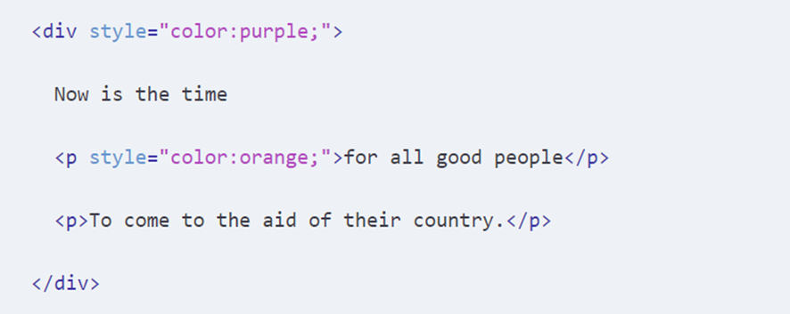

    

# Teste de Performance 2

## Exercício 03

No trecho de código HTML da imagem, de qual cor seria o parágrafo com conteúdo “To come to the aid of their country”? Reproduza o trecho de código fazendo com que este texto se fique em negrito e com a cor vermelha.

    

